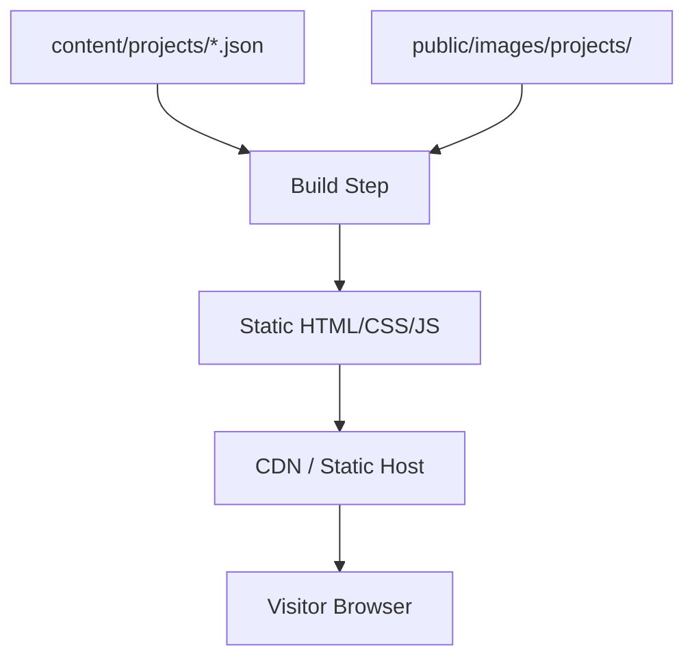
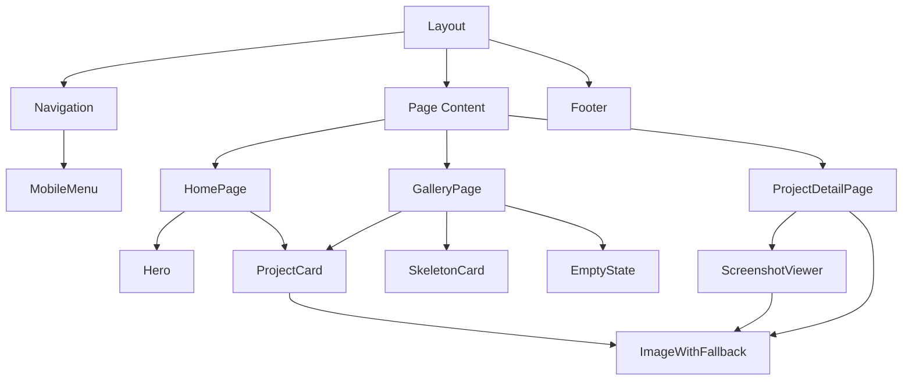

# Design Document

## Overview

A static portfolio website for a UX designer, built with Next.js (App Router) and TypeScript. The site renders project data from local JSON/MDX files into a minimal, responsive layout. No backend server or database — content is managed by editing structured data files and rebuilding.

### Key Design Decisions

1. **Next.js Static Export (`output: 'export'`)** — Pre-renders all pages at build time into plain HTML/CSS/JS files. No Node.js server in production. Output can be served by any HTTP server (nginx on a Raspberry Pi, GitHub Pages, Netlify, or any static host).
2. **JSON data source** — Projects stored in a `content/projects/` directory as individual JSON files with co-located images. Decouples content from presentation code.
3. **CSS Modules + CSS Custom Properties** — Scoped styles without runtime overhead. Design tokens via custom properties for consistent spacing, colors, and typography.
4. **next/image with static export** — Images optimized at build time. WebP/AVIF conversion, responsive sizing, lazy loading, and blur placeholders.

### Deployment Model

```
Development machine (Node.js 18+, ~512MB RAM)
  └── npm run build  →  generates /out/ folder (plain HTML files)

Production (any HTTP server, even Raspberry Pi)
  └── serves /out/ folder as static files (nginx, Apache, Python http.server, etc.)
```

No server-side runtime. No database. No Node.js in production. Just files.

### Rationale

A static site generator is the simplest correct solution for a portfolio with no dynamic user interaction. Next.js provides image optimization, file-based routing, and static export without introducing unnecessary complexity. JSON files as the data source mean the designer edits structured data, not code — and the build step validates the data before publishing. The static output runs on any hardware capable of serving HTTP files.

## Architecture



### Build Pipeline

1. `npm run build` triggers Next.js static export (`output: 'export'` in next.config.js)
2. Next.js reads project JSON files at build time via `generateStaticParams`
3. Validates each project entry against a schema (title, description, screenshots required)
4. Invalid entries are skipped — remaining valid projects are rendered
5. Images optimized into WebP/AVIF with JPEG fallback
6. Output: `/out/` folder containing static HTML, CSS, JS, and optimized images
7. Deploy by copying `/out/` to any web server

### Page Structure

```
/ (Landing Page)
├── Hero Section
└── Featured Projects Gallery (3-6 cards)

/projects (Gallery Page)
└── Full Project Grid (all valid projects)

/projects/[slug] (Project Detail Page)
├── Project Title + Description
├── Screenshot Gallery (vertical scroll)
└── Back to Gallery link
```

## Components and Interfaces

### Page Components

| Component | Route | Responsibility |
|-----------|-------|----------------|
| `HomePage` | `/` | Hero section + featured project cards |
| `GalleryPage` | `/projects` | Full responsive grid of all project cards |
| `ProjectDetailPage` | `/projects/[slug]` | Single project with screenshots and description |

### Shared Components

| Component | Props | Responsibility |
|-----------|-------|----------------|
| `Navigation` | `currentPath: string` | Site-wide nav with mobile toggle |
| `ProjectCard` | `project: ProjectSummary` | Thumbnail + title + description card |
| `ImageWithFallback` | `src, alt, width, height, fallbackSrc` | Image with error state and placeholder |
| `SkeletonCard` | `count: number` | Loading placeholder matching card dimensions |
| `Hero` | `name: string, tagline: string` | Designer intro section |
| `ScreenshotViewer` | `screenshots: Screenshot[]` | Vertical scroll layout with captions |
| `MobileMenu` | `isOpen: boolean, onToggle: () => void, links: NavLink[]` | Collapsible mobile navigation |
| `EmptyState` | `message: string` | Displayed when no projects exist |

### Component Hierarchy



## Data Models

### Project Data Schema (`content/projects/{slug}.json`)

```typescript
interface Project {
  slug: string;              // URL-friendly identifier, derived from filename
  title: string;             // Max 100 characters
  description: string;       // Max 5000 characters (detail), max 500 for summary
  shortDescription: string;  // Max 120 characters, used on cards
  featured: boolean;         // Whether to show on landing page
  order: number;             // Sort order in gallery
  screenshots: Screenshot[]; // 1-20 items
  createdAt: string;         // ISO 8601 date
}

interface Screenshot {
  src: string;               // Relative path to image file
  alt: string;               // Accessible alternative text
  caption: string;           // Max 200 characters
}

interface ProjectSummary {
  slug: string;
  title: string;             // Truncated to 60 chars for display
  shortDescription: string;  // Truncated to 120 chars for display
  thumbnail: string;         // First screenshot src used as thumbnail
}
```

### Validation Rules

| Field | Rule |
|-------|------|
| `title` | Required, 1-100 characters |
| `description` | Required, 1-5000 characters |
| `shortDescription` | Required, 1-120 characters |
| `screenshots` | Required, 1-20 items, each with valid `src` and `alt` |
| `slug` | Required, lowercase alphanumeric + hyphens only |

Projects failing validation are excluded from the build output. A build warning is logged for each skipped project.

### Navigation Data

```typescript
interface NavLink {
  label: string;
  href: string;
  isActive: boolean;
}

const NAV_LINKS: NavLink[] = [
  { label: "Home", href: "/", isActive: false },
  { label: "Projects", href: "/projects", isActive: false },
];
```

### Design Tokens (CSS Custom Properties)

```css
:root {
  /* Typography */
  --font-primary: 'Inter', sans-serif;
  --font-size-base: 16px;
  --font-size-h1: clamp(2rem, 5vw, 3.5rem);
  --font-size-body: clamp(1rem, 2vw, 1.125rem);

  /* Spacing */
  --space-xs: 0.25rem;
  --space-sm: 0.5rem;
  --space-md: 1rem;
  --space-lg: 2rem;
  --space-xl: 4rem;

  /* Layout */
  --content-max-width: 1200px;
  --content-margin: max(5%, 1rem);

  /* Colors */
  --color-bg: #fafafa;
  --color-text: #1a1a1a;
  --color-text-muted: #666666;
  --color-accent: #2563eb;
  --color-border: #e5e5e5;
  --color-placeholder: #f0f0f0;

  /* Transitions */
  --transition-fast: 150ms ease;
  --transition-normal: 300ms ease;
}
```


## Correctness Properties

*A property is a characteristic or behavior that should hold true across all valid executions of a system — essentially, a formal statement about what the system should do. Properties serve as the bridge between human-readable specifications and machine-verifiable correctness guarantees.*

### Property 1: Text truncation preserves length invariant

*For any* string input and maximum length N, the truncation function SHALL return a string of at most N characters. If the input exceeds N characters, the output SHALL end with an ellipsis ("…") and the total length including ellipsis SHALL not exceed N. If the input is N characters or fewer, the output SHALL equal the input unchanged.

**Validates: Requirements 2.2**

### Property 2: Project validation filters correctly

*For any* list of project entries (each with arbitrary field presence/absence), the validation function SHALL return exactly those entries where title is a non-empty string ≤ 100 characters, description is a non-empty string ≤ 5000 characters, shortDescription is a non-empty string ≤ 120 characters, and screenshots is a non-empty array of 1-20 items each with valid src and alt fields. No valid entry SHALL be excluded, and no invalid entry SHALL be included.

**Validates: Requirements 7.5, 1.2**

### Property 3: Featured project selection respects bounds

*For any* list of valid projects with varying `featured` flags, the featured selection function SHALL return only projects where `featured` is true, sorted by `order`, with a maximum of 6 items. The result SHALL never include a non-featured project.

**Validates: Requirements 1.2**

### Property 4: Active navigation link matches current path

*For any* valid route path in the site (/, /projects, /projects/[slug]), exactly one navigation link SHALL be marked as active, and its `href` SHALL be a prefix match of the current path. All other links SHALL be marked inactive.

**Validates: Requirements 4.4**

### Property 5: Image dimension scaling preserves minimum width

*For any* image with original dimensions (width, height) and any viewport width from 320px to 2560px, the computed display width SHALL be at least 80px and SHALL not exceed the available container width. The aspect ratio SHALL be preserved (height/width ratio unchanged within 1px rounding tolerance).

**Validates: Requirements 5.3**

## Error Handling

### Image Loading Failures

| Scenario | Behavior |
|----------|----------|
| Thumbnail fails to load | Display neutral placeholder image (gray box with icon), keep card clickable |
| Detail screenshot fails to load | Display placeholder with "Image unavailable" message and accessible alt text |
| All images fail (network issue) | Site remains navigable; text content and navigation fully functional |

### Data Validation Errors

| Scenario | Behavior |
|----------|----------|
| Project JSON missing required field | Skip project, log build warning with filename and missing field |
| Project JSON malformed (invalid JSON) | Skip project, log build error with filename and parse error |
| Zero valid projects after filtering | Display empty state message on Gallery page |
| Screenshot path references non-existent file | Build warning; image renders with fallback at runtime |

### Navigation Edge Cases

| Scenario | Behavior |
|----------|----------|
| Unknown route (404) | Display a minimal 404 page with navigation back to home |
| Direct URL access to project detail | Static page exists if project is valid; 404 otherwise |

### Performance Degradation

| Scenario | Behavior |
|----------|----------|
| Slow network | Skeleton placeholders shown during image load; text renders immediately |
| JavaScript disabled | Static HTML renders correctly (SSG); mobile menu toggle non-functional (acceptable degradation) |

## Testing Strategy

### Unit Tests (Example-Based)

Focus on specific scenarios and edge cases:

- **Hero component**: Renders name and tagline correctly
- **ProjectCard**: Renders thumbnail, truncated title, truncated description
- **Navigation**: Shows correct links, marks active page, collapses on mobile
- **ImageWithFallback**: Displays fallback on error event
- **EmptyState**: Renders when project list is empty
- **SkeletonCard**: Renders correct number of placeholders
- **Mobile menu**: Toggle opens/closes, link click closes menu

### Property-Based Tests (fast-check)

Library: **fast-check** (TypeScript property-based testing library)
Minimum iterations: **100 per property**

Each property test references its design document property:

| Test | Property | Tag |
|------|----------|-----|
| Truncation length invariant | Property 1 | `Feature: ux-portfolio-website, Property 1: Text truncation preserves length invariant` |
| Validation filters correctly | Property 2 | `Feature: ux-portfolio-website, Property 2: Project validation filters correctly` |
| Featured selection bounds | Property 3 | `Feature: ux-portfolio-website, Property 3: Featured project selection respects bounds` |
| Active nav link correctness | Property 4 | `Feature: ux-portfolio-website, Property 4: Active navigation link matches current path` |
| Image scaling minimum width | Property 5 | `Feature: ux-portfolio-website, Property 5: Image dimension scaling preserves minimum width` |

### Integration Tests

- **Build pipeline**: Add/edit/remove project JSON → rebuild → verify output
- **Responsive layout**: Verify column counts at 320px, 600px, 768px, 1024px, 2560px
- **Image optimization**: Verify output images are WebP/AVIF with JPEG fallback, ≤ 500KB
- **Performance**: Lighthouse CI checks for FCP < 2s on gallery with 20 projects

### Visual Regression Tests

- Landing page at mobile, tablet, desktop viewports
- Gallery page with 1, 6, and 20 projects
- Project detail page with varying screenshot counts
- Navigation states (desktop, mobile collapsed, mobile expanded)

### Test Tools

| Tool | Purpose |
|------|---------|
| Vitest | Unit tests and property tests runner |
| fast-check | Property-based test generation |
| React Testing Library | Component rendering and interaction |
| Playwright | Integration and visual regression tests |
| Lighthouse CI | Performance budget enforcement |
